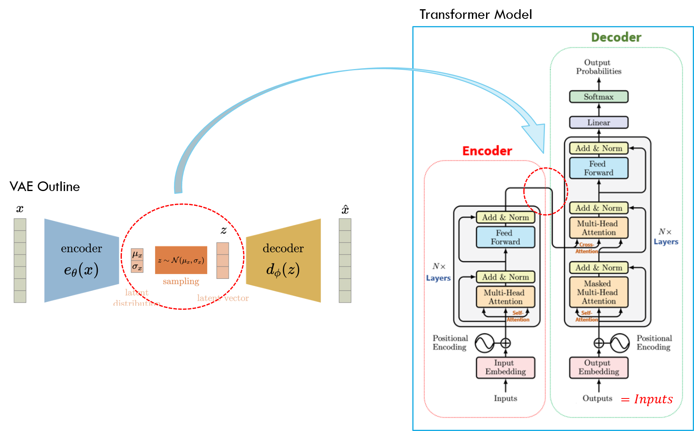

# SenTransformer-VAE-pytorch
In this project we built a sentence VAE using the Transformer encoder-decoder architecture presented in ["Attention Is All You Need" by Vaswani, Ashish, et al.](https://arxiv.org/pdf/1706.03762.pdf)  

<h4 align="center">
    
</h4>

  

We convert individual word hidden states outputted by the transformer encoder to a sentence-level representation by simply taking the hidden state of the \<sos\> token.  
The latent space representation, z, is converted to the "memory" input of the decoder using a fully connected layer.

  

[SenTransformer-VAE-pytorch](#sentransformer-vae-pytorch)
  1. [Datasets and Pre-processing](#datasets-and-pre-processing)
  2. [Training](#training)
  3. [Recommended Hyperparameters](#recommended-hyperparameters)
  4. [Results](#results)
      * [Generation](#generation)
      * [Reconstruction](#reconstruction)
      * [Interpolation in the Latent Space](#interpolation-in-the-latent-space)
  5. [Files and Directories in the Repository](#files-and-directories-in-the-repository)
  6. [Credits](#credits)

## Datasets and Pre-processing
We used the [Penn Treebank (PTB)](https://paperswithcode.com/dataset/penn-treebank) and the [WikiText-2](https://paperswithcode.com/dataset/wikitext-2) datasets to train two models, one on each dataset.  
We divide the raw text into sentences and filter out sentences longer than 45 tokens (not including \<sos\> and \<eos\>).  

**Dataset information after sentence filtering**:

|                      | Penn Treebank | WikiText-2 |
|----------------------|---------------|------------|
| Train Sentences      | 40,677        | 71,681     |
| Validation Sentences | 3,271         | 7,538      |
| Test Sentences       | 3,631         | 8,797      |
| Size of Vocabulary   | 9,925         | 28,785     |

**Sample sentences from train set**:
| Penn Treebank | 
|:----|
| *the question is \<unk\> at this point she says* |
| *the company said that it is selling two million shares and that the rest are being sold by certain stockholders* |

| WikiText-2 | 
|:--------------------------------|
| *the higher the entropy , the higher the disorder* |
| *strathaird is a relatively small peninsula close to the cuillin hills with only a few crofting communities , the island of \<unk\> lies offshore* |

## Training 
Training can be performed in `TransformerVAE.ipynb` or using `main.py`

Packages we used in training our model:

|Library     | Version          |
|------------|------------------|
|`Python`    |  `3.6 (Anaconda)`|
|`torch`     |  `1.9.1`         |
|`torchtext` |  `0.10.1`        |
|`numpy`     |  `1.19.2`        |
|`matplotlib`|  `3.3.3`         |

`main.py --help`

You should use the `main.py` file with the following arguments:

|Argument                 | Description                                                     |Legal Values                                 |
|-------------------------|-----------------------------------------------------------------|---------------------------------------------|
|-h, --help               | shows arguments description             		                    | 		                                        |
|-d, --dataset            | dataset to train on 		                                        | str: default='PTB', 'WikiText2'             |
|-e, --e_dim              | word embedding dimension		                                    | int: default=512                            |
|-a, --nheads             | number of attention heads in transformer encoder/decoder blocks | int: default=4                              |
|-q, --nTElayers          | number of transformer encoder layers                            | int: default=4                              |
|-p, --nTDlayers          | number of transformer decoder layers                            | int: default=4                              |
|-z, --z_dim              | latent dimension		                                            | int: default=32                             |
|-n, --num_epochs	        | total number of epochs to run			                              | int: default=20                             |
|-b, --batch_size         | batch size 											                                | int: default=32                             |
|-o, --optim              | optimizer for training	                                        | str: default='SGDwM', 'Adam', 'SGD'         |
|-l, --lr                 | learning rate 												                          | float: defalut=0.1                          |
|-t, --beta_sch           | beta scheduler                                                  | str: default='anneal', 'cyclic', 'constant' |
|-n, --beta_min           | minimum value of beta in scheduler                              | float: defalut=0.005                        |
|-x, --beta_max           | maximum value of beta in scheduler                              | float: defalut=0.04                         |
|-w, --beta_warmup        | number of warmup epochs beta will receive beta_min value        | int: default=4                              |
|-r, --beta_period        | number of epochs in a period of the cyclic beta scheduler       | int: default=8                              |
|-v, --save_interval      | epochs between checkpoint saving                                | int: default=5                              |
|-s, --seed               | random state to use. for random: -1 						                | int: default=-1                             |
|-c, --device             | device: -1 for cpu, 0 and up for specific cuda device					  | int: default=-1                             |

**Recommended**:

PTB - `python main.py --dataset PTB --e_dim 512 --nheads 8 --nTElayers 4 --nTDlayers 4 --z_dim 32 --num_epochs 20 --batch_size 32 --optim SGDwM --lr 0.1 --beta_sch anneal --beta_min 0.005 --beta_max 0.04 --beta_warmup 4 --save_interval 5 --seed 41 --device 0`

Wikitext-2 - `python main.py --dataset WikiText2 --e_dim 512 --nheads 8 --nTElayers 4 --nTDlayers 4 --z_dim 32 --num_epochs 30 --batch_size 32 --optim SGDwM --lr 0.1 --beta_sch anneal --beta_min 0.005 --beta_max 0.04 --beta_warmup 4 --save_interval 5 --seed 41 --device 0`

**Notes**:
* Optimizers use a step scheduler for the learning rate, `milestones` need to be written directly to `TransformerVAE.py` depending on `num_epochs` chosen.
* During training:
    * model checkpoints and figures of loss curves are saved locally.
    * train statistics are printed 5 times each epoch (reconstruction loss, KL loss, beta-VAE loss and more).
    * after each `save_interval` epochs, validation statistics are printed (reconstruction loss, KL loss, perplexity).

## Recommended Hyperparameters

|Dataset                 | `beta_sch` | \[`beta_min`,`beta_max`\] | `beta_warmup` | `optim` | `lr` | `z_dim` | `batch_size` | `num_epochs` |
|------------------------|------------|---------------------------|---------------|---------|------|---------|--------------|--------------|
|Penn Treebank (`PTB`)   |'anneal'    |\[0.005, 0.04\]            |4              |'SGDwM'  |0.1   |32       |32            |20            |
|WikiText-2 (`WikiText2`)|'anneal'    |\[0.005, 0.04\]            |4              |'SGDwM'  |0.1   |32       |32            |30            |

**Notes**:
* Feed forward dimensions of the transformer encoder/decoder blocks are set to 4 x `e_dim`
* Transformer encoder/decoder blocks' dropout = 0.2
* Due to lack of time and resources, we did not perform full hyperparameter tuning. You are welcome to update us if you have any suggestions that worked better for you.
  
## Results
All of the results can be conveniently reproduced using the provided `TransformerVAE.ipynb` notebook by loading the models from checkpoints and running the relevant cells.

|                      | Penn Treebank | WikiText-2 |
|----------------------|---------------|------------|
| Test Perplexity      | 99.9          | 144.06     |

### Generation
Generation was performed by decoding a sampled z ~ N(0,I).  
We implemented 3 simple generation policies that don’t involve evaluating several branches (such as beam search) and are commonly used in a variety of NLP tasks:
- Greedy: Choose the next word with the highest probability given by the model.
- Top K: Sample the next word from a multinomial distribution on the words with the K highest probabilities given by the model.
- Multinomial: Sample the next word from a multinomial distribution on all of the words in the vocabulary given by the model.  

Generation using our model and a greedy policy produced sentences that are mostly coherent and grammatically sound. Using the top K policy with relatively small K (<10), we managed to get more diverse sentences with a small negative impact on their coherency.  

**Generated Examples**:
| Penn Treebank | 
|:----|
| *mr . \<unk\> could n \' t be reached for comment* |
| *the company also said it expects to announce the \<unk\> agreement on nov . n* |
| *but if we were not looking for an investor you would have to buy the stocks he said* |

| WikiText-2 | 
|:--------------------------------|
| *they \' re all right now* |
| *the film was released on november 7 , 2009 , and was distributed to theatres in north america* |
| *in a february 2012 interview with mtv news , churchill told the guardian times that he was interested in returning* |

### Reconstruction
For the reconstruction task, we used a greedy decoding policy.  
The input sentences were either generated by our model or from the validation set.  
**Reconstruction Examples**:

| Penn Treebank - Example 1 || 
|:----|---------|
| Original      | *the company said that it expects to post a loss of n cents to n cents for the fiscal year ended june n* |
| Reconstructed | *the company said it expects to report a loss of about n cents to n cents a share for the third quarter* |

| Penn Treebank - Example 2 || 
|:----|---------|
| Original      | *the dow jones industrials closed off n at n* |
| Reconstructed | *the dow jones industrials finished up n points at n* |

| WikiText-2 || 
|:----|---------|
| Original      | *in addition , fernandez has appeared in several commercials for roles in numerous films such as \<unk\> and \<unk\> \<unk\> , and \<unk\>* |
| Reconstructed | *in addition , fernandez has appeared in several commercials and \<unk\> , including \<unk\> and \<unk\>* |

### Interpolation in the Latent Space
We performed interpolation between two sentences in the latent space by decoding `z = z1 * (1-t) + z2 * t` for several values of `0<t<1`, using a greedy decoding policy.

| Interpolation Example | 
|:----|
| ***in addition some of these bonuses are paid off as much as $ n million in debt*** |
| *in addition competition has generally been expected to decline as much as n n* |
| *in addition the companies will be offering prime-time programming similar packages* |
| *the two companies also agreed to settle any legal dispute with the justice department* |
| *the \<unk\> of the market has been blamed for recent weeks* |
| ***the \<unk\> of the market has been blamed for recent volatility in recent weeks*** |

## Files and Directories in the Repository

|File name             | Purpose                                                                                       |
|----------------------|-----------------------------------------------------------------------------------------------|
|`main.py`             | main application for training the Sentence Transformer-VAE                                    |
|`TransformerVAE.py`   | main training function, model architecture definition and helper functions                    |
|`TransformerVAE.ipynb`| interactive notebook for training model/loading model from checkpoint and reproducing results |
|`figs`                | directory containing images                                                                   |

## Credits
* [Technion EE 046211 - Deep Learning](https://github.com/taldatech/ee046211-deep-learning)
* [Technion EE 046202 - Unsupervised Learning and Data Analysis](https://github.com/taldatech/ee046202-unsupervised-learning-data-analysis)
* [Bowman, Samuel R., et al. "Generating sentences from a continuous space."](https://arxiv.org/pdf/1511.06349.pdf)
* [Vaswani, Ashish, et al. "Attention is all you need."](https://arxiv.org/pdf/1706.03762.pdf)
* [Fu, Hao, et al. "Cyclical annealing schedule: A simple approach to mitigating kl vanishing."](https://aclanthology.org/N19-1021.pdf)
